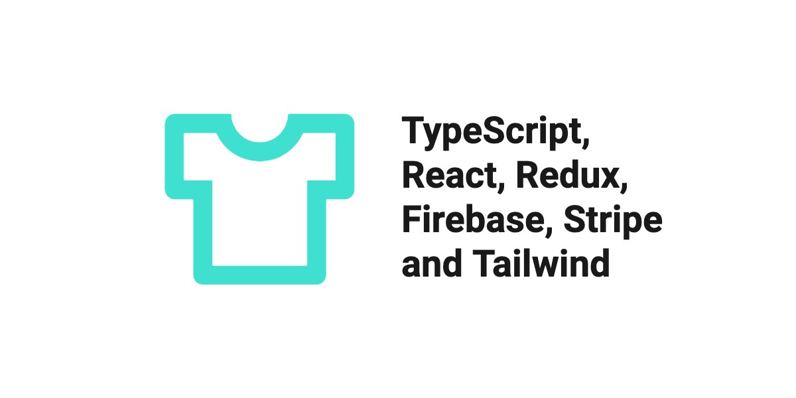

#  E-commerce Website with TypeScript, React, Redux and Firebase

This is a project that I built while learning React and Redux. It is a fully functional e-commerce website that allows users to sign in with their Google account, add items to their cart, and make payments with Stripe. 

Deployed with Netlify: [https://firebase-store-cwarcup.netlify.app/](https://firebase-store-cwarcup.netlify.app/)

## Learning and Tools

| Firebase       |                                               |
| -------------- | --------------------------------------------- |
| Authentication | Email/Password, Google Popup, Google Redirect |
| Firestore      | Use NoSQL to store user and product data      |

| Redux ToolKit |                                |
| ------------- | ------------------------------ |
| Redux Thunk   | Async actions                  |
| Redux Persist | Persist state to local storage |

| Other Tools  |                    |
| ------------ | ------------------ |
| Stripe       | Payment processing |
| Typescript   | Type checking      |
| React        | UI                 |
| React Router | Routing            |
| TailwindCSS  | Styling            |

## Firebase
### Authentication

Firebase Authentication provides backend services, easy-to-use SDKs, and ready-made UI libraries to authenticate users to your app. 

For this application I decided to use the Email/Password and Google providers for my authentication methods. 

I learnt there are a few ways you can use the Google provider. You can use the `signInWithPopup` which will open a popup window for the user to sign in with their Google account. Or you can use the `signInWithRedirect` which will redirect the user to a Google sign in page. I decided to use the `signInWithRedirect` method as I wanted to keep the user on the same page and not have a popup window open. I felt like this method was also a bit more challenging to implement and I wanted to learn how to do it.

### Firestore Database

This was my first time using a NoSQL database. I used Firestore to store the products and users. I found the documentation to be challenging because I didn't initially understand how all the pieces fit together. However, once the pieces were in place, it was easy to use.

My database is structured as follows:

```
  users
    - userId
      - createdAt
      - displayName
      - email

  categories
    - categoryName
      - items
        - itemId
          - name
          - price
          - imageUrl
```

One of the tricky things was getting data into my database. I created a helper function to take in a json object and add it to the database. I used this to add my products to the database.

## State Management

Originally used `useContext` and `useState` to manage state. Used for keep track of the user's cart, products from the database, and authentication state.

### Redux

Decided to use Redux to manage state. I noticed the cart items contained a lot of different types of data. The actual items, quantity, price, and other data. In order to keep track of the cart items, I decided to use Redux. 

```js
// shape of the cart item
{
  id: number,
  name: string,
  price: number,
  quantity: number, 
  imageUrl: string,
}

  // values/functions to pass to context
const value = {
  cartItems, // array of cart items
  addItemToCart, // function to add item to cart
  removeItemFromCart, // function to remove item from cart
  cartCount, // number of items in cart
  cartSubtotal, // subtotal of cart
  clearItemFromCart, // function to clear item from cart
}
```

We have a **lot** of stuff going on in here. Additionally, whenever we make changes to the `cartItems`, we need to update the `cartCount` and `cartSubtotal`. We are currently using `useEffect` to trigger these updates and make the changes. And each of these values are being stored as a separate state with `useState`. 

This is a very **react** way of doing things. This isn't bad, but we can make some improvements.

#### Using Redux

I've had some experience with  classic Redux but decided to use Redux Toolkit. I've heard good things about it and it's a lot easier to use. The docs were easy to follow and I was amazed at how quickly I was able to get it up and running. 

Setting up the async actions to authenticate a user using Firebase was a little tricky, but I was able to get it working within an hour. I used `redux-persist` to persist the cart items in local storage. I didn't have to worry about the authentication state because Firebase handles that for us. 

I would highly recommend using Redux Toolkit if you're looking to use Redux.

## Typescript

I originally wrote the entire application in JavaScript. I decided to add Typescript to the project. I found it to be a bit challenging at first, but once I got the hang of it, it was easy to use. 

The biggest challenge was handling types for everything in Redux. Because I moved all the logic for async actions to Redux, I had to handle types for the actions, reducers, and the state. It was a bit of a learning curve, but I was able to get it working.

Additionally, typing the Firebase functions was a bit challenging. It was difficult to remember exactly what the functions returned and what the parameters were. After a few hours I got it to work. 

I wish I implemented Typescript from the beginning. I think it would have saved me a lot of time and headaches.

## Tailwind

I've used Tailwind in the past for numerous projects, so I didn't focus too much on the styling. I wanted to focus more on the functionality of the application.
